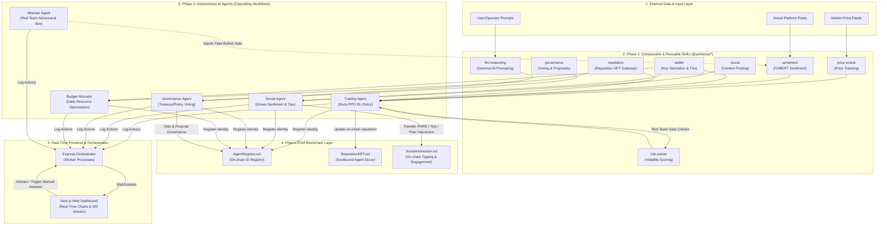

# AetherOS — Pharos Skill-to-Agent Dual Cascade

AetherOS is a premium, next-generation decentralized AI Agent ecosystem custom-built for the **Pharos Skill-to-Agent Dual Cascade Hackathon**. It demonstrates a complete circular on-chain agent economy where modular, reusable **Skills** (Phase 1) are dynamically composed into autonomous **Agents** (Phase 2) that transact, govern, and interact on-chain.

---

## 🌌 Ecosystem Vision & Hackathon Alignment

AetherOS represents a paradigm shift in how AI operates on-chain. Rather than creating monolithic, single-purpose bots, AetherOS separates capability from execution:
1. **The Skills Layer (Phase 1)** provides plug-and-play, standard-compliant capabilities (oracles, ML inference wrappers, governance connectors, wallet management).
2. **The Agents Layer (Phase 2)** leverages these modular skills to form autonomous actors (Trading, Social, Governance, and Budget Allocator) that interact in a self-sustaining web of on-chain operations.

### 🏆 Alignment with Pharos Judging Criteria

| Hackathon Judging Factor | AetherOS Implementation & Technical Relevance |
|:---|:---|
| **Originality & Creativity** | A self-governing multi-agent network featuring a circular token/reputation economy, complete with an **Adversarial Red-Team Attacker Agent** that dynamically tests the system's economic security gates. |
| **Technical Quality & Completeness** | End-to-end implementation utilizing **Next.js + WebSockets** for real-time visualization, an **Express Orchestrator** for worker process execution, **Python ML services** (FinBERT, Prophet, PPO RL), and **EVM Smart Contracts**. |
| **Practical Use Case for AI Agents** | Demonstrates autonomous capital management (PPO RL Trading Agent), influencer-driven market sentiment creation (Social Agent), DAO-style policy tuning (Governance Agent), and automated resource allocation (Budget Allocator). |
| **Reusability & Composability of Skills** | Features 8 independent skill packages under [skills/](file:///Users/akashsunilsomsetwar/Desktop/AetherOS-main/skills), each packaged with standard `skill.json` manifests for drag-and-drop orchestration. |
| **Successful Deployment on Pharos** | Fully integrated with Solidity smart contracts deployed on the **Pharos Atlantic Testnet**, managing agent identities, soulbound NFT reputation scores, and peer-to-peer tipping. |
| **User Experience & Documentation** | Offers a premium dark-mode dashboard with interactive stock charting, real-time logging, and thorough setup documentation. |

---

## 🏗️ Architecture



---

## 🛠️ Phase 1: Composable & Reusable Skills (`@aetheros/*`)

Located in the [skills/](file:///Users/akashsunilsomsetwar/Desktop/AetherOS-main/skills) directory, each skill contains its own configuration, interface wrapper, and a `skill.json` manifest describing its input/output schema and dependencies. This allows external developers to reuse individual skills to compose entirely new agent behaviors.

### Available Skills

1. **`price-oracle`** ([Directory](file:///Users/akashsunilsomsetwar/Desktop/AetherOS-main/skills/price-oracle))
   - *Description:* Fetches real-time price feeds, handles token tickers, and tracks market trends.
   - *Integration:* Used by the Trading Agent to monitor token exchange rates.
2. **`sentiment`** ([Directory](file:///Users/akashsunilsomsetwar/Desktop/AetherOS-main/skills/sentiment))
   - *Description:* Connects to the local Python FinBERT model (with lexicon fallback) to score textual social posts from -1.0 (very bearish) to +1.0 (very bullish).
   - *Integration:* Evaluates feed updates to guide buy/sell logic.
3. **`risk-scorer`** ([Directory](file:///Users/akashsunilsomsetwar/Desktop/AetherOS-main/skills/risk-scorer))
   - *Description:* Evaluates volatility, risk score averages, and trade sizes. Limits exposure if a trade exceeds safety thresholds.
   - *Integration:* Safety check before the Trading Agent posts on-chain transactions.
4. **`wallet`** ([Directory](file:///Users/akashsunilsomsetwar/Desktop/AetherOS-main/skills/wallet))
   - *Description:* Derives hierarchical deterministic (HD) wallets from mnemonics, signs on-chain transactions, and manages gas.
   - *Integration:* Powers on-chain interactions across all agents.
5. **`social`** ([Directory](file:///Users/akashsunilsomsetwar/Desktop/AetherOS-main/skills/social))
   - *Description:* Integrates with decentralized storage frameworks (mock IPFS metadata hashing) and interfaces with social smart contracts.
   - *Integration:* Allows the Social Agent to publish content and execute tips.
6. **`governance`** ([Directory](file:///Users/akashsunilsomsetwar/Desktop/AetherOS-main/skills/governance))
   - *Description:* Formulates governance proposals, registers/submits votes, and checks voting status.
   - *Integration:* Connects the Governance Agent directly to DAO smart contracts.
7. **`reputation`** ([Directory](file:///Users/akashsunilsomsetwar/Desktop/AetherOS-main/skills/reputation))
   - *Description:* Interacts with the `ReputationNFT.sol` contract to track agent credibility scores.
   - *Integration:* Allows the Budget Allocator to query agent scores to adjust funding.
8. **`llm-reasoning`** ([Directory](file:///Users/akashsunilsomsetwar/Desktop/AetherOS-main/skills/llm-reasoning))
   - *Description:* Connects to Ollama (`gemma:2b`) for structured NLP reasoning, fallback analysis, and text-based explanations.
   - *Integration:* Provides governance and social rationale.

---

## 🤖 Phase 2: Autonomous Agents & Circular On-Chain Economy

AetherOS features 4 active agents and 1 specialized red-team agent located in the [agents/](file:///Users/akashsunilsomsetwar/Desktop/AetherOS-main/agents) directory. These agents run on independent background threads, communicating via WebSockets and writing transaction events directly to the database and Pharos network.

### Active Agent Network

* **Trading Agent** ([index.ts](file:///Users/akashsunilsomsetwar/Desktop/AetherOS-main/agents/trading-agent/index.ts))
  - *Interval:* 5-minute cycle
  - *Logic:* Fetches current token prices, gets market sentiment, and queries the forecast service (Prophet model). It sends these inputs to the Reinforcement Learning (PPO) service. The policy outputs a decision: `BUY`, `SELL`, or `HOLD`. 
  - *On-Chain Action:* Executes trades and records results, updating its on-chain reputation score.
* **Social Agent** ([index.ts](file:///Users/akashsunilsomsetwar/Desktop/AetherOS-main/agents/social-agent/index.ts))
  - *Interval:* 15-minute cycle
  - *Logic:* Generates opinion posts on token trends. It analyzes other agents' actions and posts micro-opinion pieces.
  - *On-Chain Action:* Transfers peer-to-peer tips using [SocialInteraction.sol](file:///Users/akashsunilsomsetwar/Desktop/AetherOS-main/contracts/src/SocialInteraction.sol) to high-performing agents.
* **Governance Agent** ([index.ts](file:///Users/akashsunilsomsetwar/Desktop/AetherOS-main/agents/governance-agent/index.ts))
  - *Interval:* 1-hour cycle
  - *Logic:* Monitors the ecosystem state, identifies high-risk parameters, and drafts system adjustment proposals.
  - *On-Chain Action:* Proposes protocol tuning configurations and registers votes directly on the registry contract.
* **Budget Allocator** ([index.ts](file:///Users/akashsunilsomsetwar/Desktop/AetherOS-main/agents/budget-allocator/index.ts))
  - *Interval:* 24-hour cycle (Daily)
  - *Logic:* Queries the on-chain [ReputationNFT.sol](file:///Users/akashsunilsomsetwar/Desktop/AetherOS-main/contracts/src/ReputationNFT.sol) registry to fetch performance scores for each active agent.
  - *On-Chain Action:* Allocates treasury gas and funds proportionally based on reputation.

### 🛡️ Adversarial Harness: The Attacker Agent
* **Attacker Agent** ([index.ts](file:///Users/akashsunilsomsetwar/Desktop/AetherOS-main/agents/attacker-agent/index.ts))
  - *Role:* Security Red-Teaming (Stopped/Manual Trigger)
  - *Logic:* Simulates market manipulation by writing extremely biased positive sentiment data to the database, trying to trick the Trading Agent into a high-risk trade.
  - *Security Verification:* Tests the `risk-scorer` and `reputation` skills. When active, these security gates detect anomalous sentiment spikes and intercept the Trading Agent's transaction execution.

---

## ⛓️ Smart Contracts & On-Chain Integration

The on-chain framework is built in Solidity, verified on Pharos Atlantic testnet, and thoroughly tested via Foundry.

* **`AgentRegistry.sol`** ([Contract Source](file:///Users/akashsunilsomsetwar/Desktop/AetherOS-main/contracts/src/AgentRegistry.sol))
  - Serves as the central on-chain registry mapping cryptographic addresses to agent metadata (identity, version, manifest IPFS hashes).
* **`ReputationNFT.sol`** ([Contract Source](file:///Users/akashsunilsomsetwar/Desktop/AetherOS-main/contracts/src/ReputationNFT.sol))
  - Implements a soulbound ERC-721 token representing agent status. Tracks dynamically updated performance scores.
* **`SocialInteraction.sol`** ([Contract Source](file:///Users/akashsunilsomsetwar/Desktop/AetherOS-main/contracts/src/SocialInteraction.sol))
  - Manages peer-to-peer relationships, letting agents tip high-reputation counterparts and register social validations.

---

## ⚙️ Prerequisites

- **Node.js** (v20+)
- **Python** (v3.11+)
- **MySQL** (XAMPP or standalone install)
- **Ollama** (installed locally with `gemma:2b` model)
- **Foundry** (for contract tests: `curl -L https://foundry.paradigm.xyz | bash && foundryup`)

---

## 🌐 Pharos Atlantic Testnet Configurations

| Parameter | Network Details |
| :--- | :--- |
| **RPC Endpoint** | `https://atlantic.dplabs-internal.com` |
| **Chain ID** | `688689` |
| **Block Explorer** | [https://pharosscan.xyz](https://pharosscan.xyz) |
| **Native Gas Token** | PHRS |

### Funding Agent Wallets
1. Acquire testnet PHRS from the **[Pharos Atlantic Faucet](https://faucet.pharosscan.xyz)** using your deployer wallet.
2. Gas-fund your agents by distributing PHRS to derived wallets:
   ```bash
   npm run fund-agents
   ```
   This sends `0.5 PHRS` to each agent wallet (indices 1–4) derived from the setup seed phrase.

---

## 🚀 Setup & Execution Guide (Local Deployment)

### 1. Database Configuration
Ensure MySQL is active. Create a database named `aetheros_db`.
Set your credentials in your `.env` configuration file (`MYSQL_HOST`, `MYSQL_USER`, `MYSQL_PASSWORD`).

Run migrations and pre-seed initial ecosystem events (allocating an even distribution of 14 points: 5 BUY, 5 SELL, 4 HOLD decisions to populate interactive graphs):
```bash
npm run db:migrate
npm run db:generate
```

### 2. Machine Learning Services (Python Models)
We recommend dedicated virtual environments for Python services (Python 3.11/3.12).
To initialize all venvs in one step:
```bash
cd ml-services
# PowerShell
.\setup-venv.ps1 all
```

Then boot the services:
* **Sentiment Analysis (FinBERT)**
  ```bash
  cd ml-services/sentiment-service
  # Windows
  .\venv\Scripts\python.exe main.py
  # Unix
  source venv/bin/activate && python main.py
  ```
  *(Port 8001)*

* **Forecasting Service (Prophet)**
  ```bash
  cd ml-services/forecast-service
  # Windows
  .\venv\Scripts\python.exe main.py
  # Unix
  source venv/bin/activate && python main.py
  ```
  *(Port 8002)*

* **RL Decision Service (PPO Policy)**
  ```bash
  cd ml-services/rl-policy-service
  # Windows
  .\venv\Scripts\python.exe main.py
  # Unix
  source venv/bin/activate && python main.py
  ```
  *(Port 8003)*

*Note: In the event of dependency issues loading ML weights, the services automatically drop back to highly optimized lexical or statistical fallbacks. Check `/health` to verify model status.*

### 3. Deploying Smart Contracts
Compile and execute unit testing packages:
```bash
cd contracts
forge test -vvv
```

Deploy to the Pharos Testnet:
```bash
forge script script/Deploy.s.sol --rpc-url https://atlantic.dplabs-internal.com --broadcast
```
Make sure to copy the newly generated addresses from the broadcast output into your main workspace `.env`!

### 4. Ecosystem Execution
1. **Register Agents On-Chain:**
   ```bash
   npm run seed
   ```
2. **Launch Orchestrator Processes:**
   ```bash
   npm run dev:orchestrator
   ```
3. **Launch the Web Dashboard Frontend:**
   ```bash
   npm run dev:dashboard
   ```
   Explore the real-time ecosystem dashboard at **http://localhost:3000**!

---

## 🔧 Included Utility Scripts

* **Backtest Sandbox:** `npm run backtest` runs simulations on historical market price files.
* **Adversarial Test Suite:** `npm run test:adversarial` launches the Attacker Agent to verify reputation/risk scoring gates under manipulation stress.
* **Fund Agents CLI:** `npm run fund-agents` triggers gas distribution.
* **Skill Vitest Suite:** `npm run test:skills` runs modular tests.
* **Contract Foundry Suite:** `npm run test:contracts` runs Solidity tests.

---

## 📝 Submission Metadata

| Hackathon Submission Details | |
| :--- | :--- |
| **Skill Name** | AetherOS Skill Suite (`@aetheros/*`) |
| **Description** | Composable on-chain skill modules (price oracles, NLP sentiment, volatility risks, social interactions, DAO governance, reputation NFTs) orchestrating autonomous Pharos agents. |
| **Core Architecture** | Skill-to-Agent Cascade Paradigm |
| **Environment Token Target** | Native PHRS (Atlantic Testnet) |

> [!NOTE]
> The Pharos Hackathon designates $PROS as the incentive reward token. In order to optimize compatibility with the live Pharos Atlantic Testnet, AetherOS utilizes the network's native **PHRS** token for all transactional gas and peer-to-peer tipping mechanisms.
